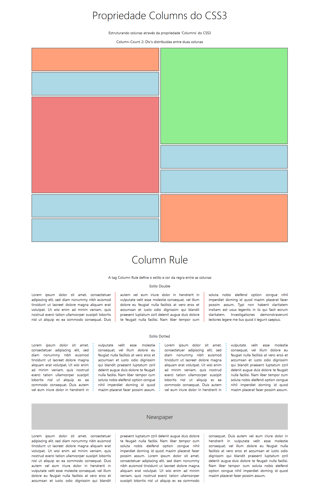

# Propriedade Column CSS3
Aqui vemos como a propriedade 'Column' pode ser aplicada via CSS3 para criar um template na nossa página. O objetivo dessa aplicação foi desenvolver um template sem o uso de Display GRID, Flex ou Float, mas ainda assim construir um template bem estruturado, Pixel Perfect e Responsivo. 
## Tela

